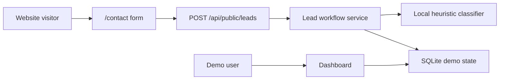

# Architecture

AI Reception Lite is intentionally small: a Next.js app, a local SQLite demo
store, and mock business logic that makes the product flow visible without
external infrastructure.

## Runtime Shape

| Area | Implementation |
| --- | --- |
| UI | Next.js App Router and React Server Components |
| Storage | Local SQLite file at `.data/ai-reception-lite.sqlite` |
| Auth | Demo httpOnly cookie |
| AI | Local heuristic classifier with schema validation |
| Notifications | Mock no-op return value |
| Tests | Vitest for units, Playwright for the public-to-dashboard flow |

## Data Flow

1. A visitor submits `/contact`.
2. `/api/public/leads` rate-limits and validates the JSON payload.
3. `createLeadFromPublicInput` creates the lead, conversation, classification,
   and follow-up task.
4. The classifier returns a local mock classification and response draft.
5. The dashboard reads the same SQLite-backed demo state.

## Storage

`src/lib/data/sqlite-repository.ts` implements the repository contract. The
database contains one compact `demo_state` row with JSON payload. This is a
deliberate portfolio simplification: it gives local persistence without a full
production schema.

## Security Boundaries

- Public input is validated with Zod.
- API errors return generic messages.
- SQLite files and env files are ignored by Git.
- There are no service-role keys, API keys, webhooks, or provider secrets.

## Deployment Notes

This project is best treated as a local or single-instance demo. Serverless
deployments may recreate or lose local SQLite state between instances. That is
acceptable for portfolio visibility, but not for production CRM use.
