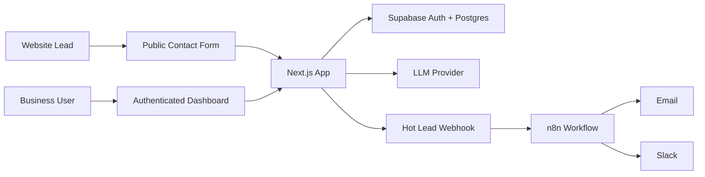
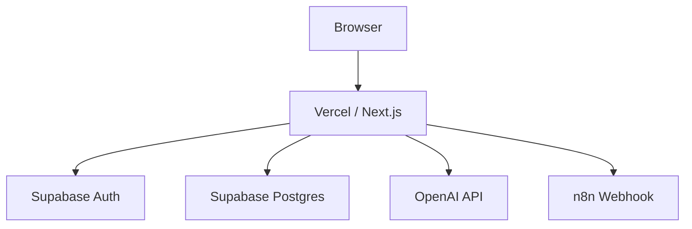

# Architecture

## Design Principles

- **Commercial workflow first:** every AI output should help a business respond, qualify, or follow up.
- **Human review by default:** AI suggests classifications and actions; users can override them.
- **Provider portability:** OpenAI is the default LLM provider, but the classifier should be replaceable.
- **Small-business simplicity:** avoid enterprise CRM complexity in the MVP.
- **Public-demo safe:** sample data and simulated responses should not expose secrets or send real messages by default.

## System Context



## Containers

| Container | Responsibility |
| --- | --- |
| Next.js app | UI, server actions/API routes, lead intake, dashboard, business settings |
| Supabase Auth | User authentication and session management |
| Supabase Postgres | Persistent storage for businesses, leads, messages, AI classifications, and tasks |
| LLM provider | Structured classification, summary generation, and response drafting |
| n8n workflow | Optional hot-lead notifications to email or Slack |

## Core Modules

```text
src/app/
├── contact/
├── (auth)/
│   ├── login/
│   └── signup/
├── (dashboard)/
│   ├── dashboard/
│   ├── leads/
│   └── settings/
├── api/
│   ├── public/leads/
│   └── leads/
src/lib/
├── ai/
│   ├── classifier.ts
│   ├── fallback-classifier.ts
│   ├── openai-classifier.ts
│   └── schema.ts
├── supabase/
│   ├── browser.ts
│   ├── server.ts
│   └── service-role.ts
├── leads/
│   ├── validation.ts
│   └── service.ts
├── data/
│   ├── repository.ts
│   ├── memory-repository.ts
│   └── supabase-repository.ts
├── auth/
│   ├── actions.ts
│   └── session.ts
└── tasks/
    └── service.ts
```

The MVP uses a repository interface so the same workflow can run against
Supabase in production and an explicit in-memory store for local demos and E2E
tests.

## Data Flow: Public Lead Capture

1. Lead submits name, contact details, service interest, and message.
2. App validates the payload at the API boundary.
3. App creates a `leads` row and initial `conversations` message.
4. App calls the AI classification service.
5. AI returns a structured JSON result.
6. App stores an `ai_classifications` row.
7. App updates the lead with temperature, funnel stage, and summary.
8. App creates a follow-up task.
9. If temperature is `hot`, app triggers the optional n8n webhook.
10. Dashboard displays the updated lead.

## Data Flow: Dashboard Review

1. Authenticated user opens the dashboard.
2. Supabase Auth validates the session.
3. Server-side queries use the authenticated user's business scope.
4. User reviews lead summary, AI fields, and conversation history.
5. User can update task status. Lead overrides are planned after the MVP.

## Multi-Tenancy Model

The recommended MVP model is **one business per user account**, with a schema that can later support multiple users per business.

Recommended entities:

- `profiles`: user profile connected to Supabase Auth
- `businesses`: business settings and AI behavior configuration
- `business_members`: join table for future team support
- `leads`: qualified lead records
- `conversations`: messages linked to leads
- `ai_classifications`: immutable AI result history
- `follow_up_tasks`: operational tasks for the team

## AI Boundary

The AI service must return structured JSON validated by a schema before persistence.

The application should never trust raw model output. Treat model output as external input:

- Validate required fields.
- Clamp enum values.
- Store confidence separately from final lead status.
- Fall back to `warm` and `ask_more_information` when parsing fails.
- Keep raw model output for debugging only if it contains no sensitive data or is stored with clear access controls.

## Security Model

- Supabase Auth protects all dashboard routes.
- Row-level security limits authenticated dashboard reads and updates by
  business membership. Server-only service-role access is reserved for public
  lead ingestion and account/business bootstrap work that cannot be performed
  directly by anonymous browser clients.
- Public lead submission is rate-limited and validates input.
- Service-role keys are server-only and never exposed to the browser.
- LLM API keys are server-only environment variables.
- Optional n8n webhook secrets are sent only from server-side outbound requests.
- Error responses do not expose prompts, keys, stack traces, or database details.

## Reliability

- AI classification should be asynchronous or retryable for production deployments.
- If classification fails, the lead should still be stored.
- The dashboard should show an explicit `classification_status`.
- Hot-lead notifications should not block lead capture.
- n8n webhook failures should be logged and retried where possible.

## Observability

Track these events:

- Lead submitted
- AI classification requested
- AI classification succeeded
- AI classification failed
- Follow-up task created
- Hot-lead webhook sent
- User override created
- Task completed

For the MVP, application logs are enough. Production deployments should add structured logging and error monitoring.

## Local Demo Mode

`AI_RECEPTION_STORAGE=memory` provides a zero-credential local demo and test
mode. It stores data only in the running Next.js process and should not be used
for production. Supabase remains the production storage and auth target, and
production runtime forces Supabase storage even if the memory flag is present.

## Current MVP Limitations

- Public lead rate limiting is in-memory and should be replaced with durable,
  distributed rate limiting for production traffic.
- Lead classification is synchronous during public submission; production
  deployments should move provider calls and webhook retries to a queue.
- The implemented API surface is limited to public lead creation and
  authenticated lead reads. Manual lead edits and reclassification endpoints are
  planned, not shipped.

## Deployment Topology



## Architecture Decisions

| Decision | Choice | Reason |
| --- | --- | --- |
| App framework | Next.js | Strong full-stack TypeScript fit and simple Vercel deployment |
| Database | Supabase Postgres | Auth, relational data, RLS, and fast setup |
| Styling | Tailwind CSS | Fast UI iteration with consistent design tokens |
| AI integration | Provider abstraction | Keeps OpenAI optional and avoids hard vendor lock-in |
| Automation | n8n JSON export | Makes the workflow inspectable and portable |
| AI response mode | Simulated by default | Keeps demo safe and avoids accidental customer messaging |

## Future Extensions

- Embeddable JavaScript widget
- WhatsApp Business API integration
- Instagram DM ingestion
- Team roles and permissions
- Lead scoring history
- CRM export
- Stripe billing for hosted SaaS version
- Prompt tuning dashboard
- Analytics for response time and conversion rate
