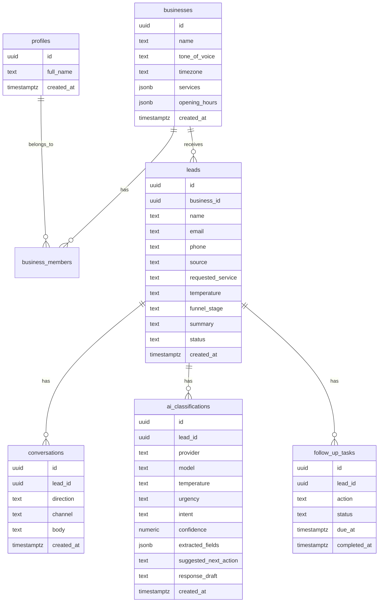

# Data Model

## Overview

AI Reception Lite stores raw lead messages, structured AI classification, business configuration, and follow-up tasks. The schema is designed for Supabase Postgres with row-level security.

See [supabase/schema.sql](../supabase/schema.sql) for the implementation-ready SQL draft.

## Entity Relationship

## Tables

### `profiles`

Stores public profile data for authenticated users. The primary key matches `auth.users.id`.

| Column | Type | Notes |
| --- | --- | --- |
| `id` | `uuid` | References `auth.users.id` |
| `full_name` | `text` | Optional display name |
| `created_at` | `timestamptz` | Defaults to `now()` |

### `businesses`

Stores the business configuration used by the AI receptionist.

| Column | Type | Notes |
| --- | --- | --- |
| `id` | `uuid` | Primary key |
| `name` | `text` | Business name |
| `tone_of_voice` | `text` | Example: professional, friendly, direct |
| `timezone` | `text` | Example: `Europe/London` |
| `services` | `jsonb` | Array of offered services |
| `opening_hours` | `jsonb` | Weekly schedule |
| `created_at` | `timestamptz` | Defaults to `now()` |
| `updated_at` | `timestamptz` | Updated by trigger |

### `business_members`

Connects users to businesses and allows future team roles.

The MVP supports one business per profile. A unique index on `profile_id`
prevents the dashboard from picking an arbitrary business for a user with
multiple memberships. Future multi-business support should add explicit
business selection before removing that constraint.

| Column | Type | Notes |
| --- | --- | --- |
| `business_id` | `uuid` | References `businesses.id` |
| `profile_id` | `uuid` | References `profiles.id` |
| `role` | `text` | `owner`, `admin`, or `member` |
| `created_at` | `timestamptz` | Defaults to `now()` |

### `leads`

The operational lead record shown in the dashboard.

| Column | Type | Notes |
| --- | --- | --- |
| `business_id` | `uuid` | Owner business |
| `name` | `text` | Lead name |
| `email` | `text` | Optional |
| `phone` | `text` | Optional |
| `source` | `text` | `website`, `whatsapp`, `instagram`, `manual`, `demo` |
| `requested_service` | `text` | Extracted or submitted |
| `temperature` | `text` | `hot`, `warm`, `cold`, or `unclassified` |
| `funnel_stage` | `text` | Example: `new`, `qualified`, `proposal`, `won`, `lost` |
| `summary` | `text` | AI-generated summary |
| `status` | `text` | Operational state |

### `conversations`

Stores message history linked to a lead.

| Column | Type | Notes |
| --- | --- | --- |
| `lead_id` | `uuid` | References `leads.id` |
| `direction` | `text` | `inbound`, `outbound`, `internal` |
| `channel` | `text` | `website`, `whatsapp`, `instagram`, `email`, `phone`, `manual` |
| `body` | `text` | Message body |
| `created_at` | `timestamptz` | Defaults to `now()` |

### `ai_classifications`

Stores immutable AI classification attempts. Keep history so users can audit changes and compare provider behavior over time.

| Column | Type | Notes |
| --- | --- | --- |
| `lead_id` | `uuid` | References `leads.id` |
| `provider` | `text` | Example: `openai` |
| `model` | `text` | Example: `gpt-4.1-mini` |
| `temperature` | `text` | AI lead temperature |
| `urgency` | `text` | `high`, `medium`, `low`, `unknown` |
| `intent` | `text` | Commercial intent |
| `confidence` | `numeric` | 0-1 |
| `extracted_fields` | `jsonb` | Budget, timeline, requested service, objections |
| `suggested_next_action` | `text` | Follow-up recommendation |
| `response_draft` | `text` | Simulated response |

### `follow_up_tasks`

Tasks created from AI classification or manual action.

| Column | Type | Notes |
| --- | --- | --- |
| `lead_id` | `uuid` | References `leads.id` |
| `action` | `text` | `call`, `send_proposal`, `ask_more_information`, `schedule_meeting`, `send_pricing`, `nurture` |
| `status` | `text` | `open`, `in_progress`, `completed`, `cancelled` |
| `due_at` | `timestamptz` | Recommended follow-up deadline |
| `completed_at` | `timestamptz` | Completion timestamp |

## Row-Level Security

RLS should enforce that authenticated users can only access data for businesses where they are members.

Public lead submission is the exception. It should use a controlled server route, not direct anonymous database writes from the browser.

## Data Retention

For a public demo, seed data should be fake. Production users should be able to delete leads and conversations. A future hosted version should define a retention policy for raw conversation content.
